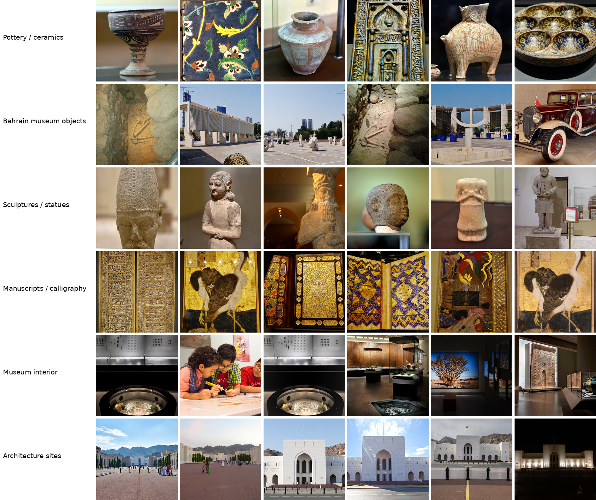

# CLIP-Based Text-to-Image Retrieval for Arab Cultural Heritage Collections

This repository contains code, dataset metadata, prompts, evaluation scripts, and result files for a CLIP-based text-to-image retrieval experiment on Arab cultural heritage image collections.

The project evaluates pretrained CLIP-based models for retrieving museum-related images using English and Arabic text prompts. No model training or fine-tuning is performed.

## Paper

This repository accompanies the paper:

**CLIP-Based Text-to-Image Retrieval for Arab Cultural Heritage Collections**

Submitted to the **1st International Conference on Digital Humanities (HDTC’2026): Humanities and Digital Transformation: A Future Vision**.

The paper contains the full motivation, methodology, discussion, and final analysis. This repository is mainly intended to support reproducibility.

## What is included

- Wikimedia Commons metadata collection scripts
- image download and validation scripts
- CLIP image embedding scripts
- text-to-image retrieval scripts
- automatic Precision@K and MRR evaluation
- manual relevance review tools
- plotting, table generation, and model comparison scripts
- result files used for the paper

## Dataset

The dataset contains 242 museum-related images collected from Wikimedia Commons categories related to Bahrain, Qatar, Iraq, and Oman.

The categories are treated as weak labels because they are derived from Wikimedia Commons categories rather than expert object-level annotations.

| Category | Images |
|---|---:|
| pottery_ceramics | 80 |
| bahrain_museum_objects | 40 |
| sculptures_statues | 40 |
| manuscript_calligraphy | 40 |
| museum_interior | 30 |
| architecture_sites | 12 |
| **Total** | **242** |

The country field refers to the museum/source category used during collection, not necessarily the historical origin of each object.

## Dataset sample

The figure below shows sample images from the six weak category labels used in the dataset.



The thumbnails are resized and arranged for visualization only. Full attribution for the images shown in this figure is provided in:

```text
assets/figure_sample_grid_attribution.csv
```

Full attribution metadata for the complete dataset is provided in:

```text
data/metadata/images_manifest_commons_usable.csv
```

## Models

| Model | Text encoder | Image encoder |
|---|---|---|
| OpenAI CLIP ViT-B/32 | CLIP text transformer | ViT-B/32 |
| OpenAI CLIP ViT-L/14 | CLIP text transformer | ViT-L/14 |
| OpenCLIP XLM-R ViT-B/32 | XLM-RoBERTa | ViT-B/32 |

## Repository scripts

| Script | Purpose |
|---|---|
| `scripts/00_check_env.py` | Check Python, PyTorch, CUDA, and OpenCLIP environment |
| `scripts/01_build_wikimedia_dataset.py` | Collect Wikimedia Commons metadata |
| `scripts/02_download_images.py` | Download images from the metadata CSV |
| `scripts/03_validate_images.py` | Validate downloaded image files |
| `scripts/04_create_usable_manifest.py` | Create the final usable image manifest |
| `scripts/05_embed_images.py` | Generate image embeddings with a CLIP/OpenCLIP model |
| `scripts/06_run_retrieval.py` | Run text-to-image retrieval and automatic evaluation |
| `scripts/07_prepare_manual_review.py` | Generate manual relevance review files |
| `scripts/08_evaluate_manual.py` | Evaluate manual relevance labels |
| `scripts/09_make_plots.py` | Generate dataset and retrieval plots |
| `scripts/10_make_tables.py` | Generate summary tables |
| `scripts/11_compare_models.py` | Compare automatic metrics across models |

## Setup

Create and activate a Python environment:

```bash
python3 -m venv venv_clip
source venv_clip/bin/activate

python -m pip install -U pip setuptools wheel
```

For CUDA 12.8 GPU support, install PyTorch first:

```bash
pip install torch==2.11.0 torchvision==0.26.0 torchaudio==2.11.0 \
  --index-url https://download.pytorch.org/whl/cu128
```

Then install the remaining requirements:

```bash
pip install -r requirements.txt
```

Check the environment:

```bash
python scripts/00_check_env.py
```

## Build the dataset

Collect Wikimedia Commons metadata:

```bash
python scripts/01_build_wikimedia_dataset.py \
  --input data/metadata/wikimedia_commons_sources_small.csv \
  --out-csv data/metadata/wikimedia_commons_manifest.csv \
  --image-width 700 \
  --min-wait 8
```

Download images:

```bash
python scripts/02_download_images.py \
  --input data/metadata/wikimedia_commons_manifest.csv \
  --manifest-out data/metadata/images_manifest_commons.csv \
  --sleep 1 \
  --retries 6
```

Validate downloaded images:

```bash
python scripts/03_validate_images.py \
  --manifest data/metadata/images_manifest_commons.csv \
  --out data/metadata/images_manifest_commons_checked.csv
```

Create the usable image manifest:

```bash
python scripts/04_create_usable_manifest.py \
  --input data/metadata/images_manifest_commons_checked.csv \
  --output data/metadata/images_manifest_commons_usable.csv
```

## Generate embeddings and run retrieval

### OpenAI CLIP ViT-B/32

Generate image embeddings:

```bash
python scripts/05_embed_images.py \
  --manifest data/metadata/images_manifest_commons_usable.csv \
  --model-name ViT-B-32 \
  --pretrained openai \
  --batch-size 64
```

Run retrieval:

```bash
python scripts/06_run_retrieval.py \
  --embedding-dir results/embeddings/ViT-B-32_openai \
  --prompts configs/prompts.csv \
  --model-name ViT-B-32 \
  --pretrained openai \
  --top-k 10
```

### OpenAI CLIP ViT-L/14

Generate image embeddings:

```bash
python scripts/05_embed_images.py \
  --manifest data/metadata/images_manifest_commons_usable.csv \
  --model-name ViT-L-14 \
  --pretrained openai \
  --batch-size 32
```

Run retrieval:

```bash
python scripts/06_run_retrieval.py \
  --embedding-dir results/embeddings/ViT-L-14_openai \
  --prompts configs/prompts.csv \
  --model-name ViT-L-14 \
  --pretrained openai \
  --top-k 10
```

### OpenCLIP XLM-R ViT-B/32

Generate image embeddings:

```bash
python scripts/05_embed_images.py \
  --manifest data/metadata/images_manifest_commons_usable.csv \
  --model-name xlm-roberta-base-ViT-B-32 \
  --pretrained laion5b_s13b_b90k \
  --batch-size 32
```

Run retrieval:

```bash
python scripts/06_run_retrieval.py \
  --embedding-dir results/embeddings/xlm-roberta-base-ViT-B-32_laion5b_s13b_b90k \
  --prompts configs/prompts.csv \
  --model-name xlm-roberta-base-ViT-B-32 \
  --pretrained laion5b_s13b_b90k \
  --top-k 10
```

## Manual relevance review

Generate a manual review sheet for a model:

```bash
python scripts/07_prepare_manual_review.py \
  --topk results/retrieval/ViT-B-32_openai/topk_results.csv \
  --out-dir results/review/ViT-B-32_openai \
  --repo-root .
```

Then fill:

```text
results/review/ViT-B-32_openai/manual_review.csv
```

Use:

```text
1 = relevant
0 = not relevant
```

Evaluate manual labels:

```bash
python scripts/08_evaluate_manual.py \
  --review-csv results/review/ViT-B-32_openai/manual_review.csv \
  --out results/review/ViT-B-32_openai/manual_metrics.csv
```

Repeat the same process for the other model result folders if needed.

## Generate plots

Generate plots for a model:

```bash
python scripts/09_make_plots.py \
  --manifest data/metadata/images_manifest_commons_usable.csv \
  --metrics results/retrieval/ViT-B-32_openai/prompt_metrics_auto.csv \
  --topk results/retrieval/ViT-B-32_openai/topk_results.csv \
  --out-dir results/plots/ViT-B-32_openai
```

The script can also be used with manual metrics by changing the `--metrics` path.

## Generate tables

Generate summary tables for a model:

```bash
python scripts/10_make_tables.py \
  --manifest data/metadata/images_manifest_commons_usable.csv \
  --metrics results/retrieval/ViT-B-32_openai/prompt_metrics_auto.csv \
  --out-dir results/tables/ViT-B-32_openai
```

## Compare models

Compare automatic retrieval metrics across the three model result folders:

```bash
python scripts/11_compare_models.py \
  --retrieval-root results/retrieval \
  --out-dir results/comparison
```

This generates comparison CSV files under:

```text
results/comparison/
```

## Main results

Manual relevance evaluation results:

| Model | Avg P@5 | Avg MRR | EN P@5 | EN MRR | AR P@5 | AR MRR |
|---|---:|---:|---:|---:|---:|---:|
| OpenAI CLIP ViT-B/32 | 0.57 | 0.64 | 0.80 | 0.85 | 0.12 | 0.23 |
| OpenAI CLIP ViT-L/14 | 0.56 | 0.62 | 0.80 | 0.86 | 0.08 | 0.13 |
| OpenCLIP XLM-R ViT-B/32 | 0.84 | 0.87 | 0.78 | 0.80 | 0.96 | 1.00 |

## Repository structure

```text
assets/                  README images and figure attribution
configs/                 Retrieval prompts
data/metadata/           Wikimedia Commons metadata and usable image manifest
scripts/                 Numbered pipeline scripts
results/                 Retrieval outputs, review files, tables, plots, and comparisons
```

## Image attribution and licensing

Images are collected from Wikimedia Commons. Each image has its own file-level license.

The dataset metadata records available attribution information, including Commons file title, creator or credit information, file page URL, image URL, license information, and processing notes.

The metadata is kept for traceability and attribution. It is not used as input to the retrieval models or evaluation metrics.